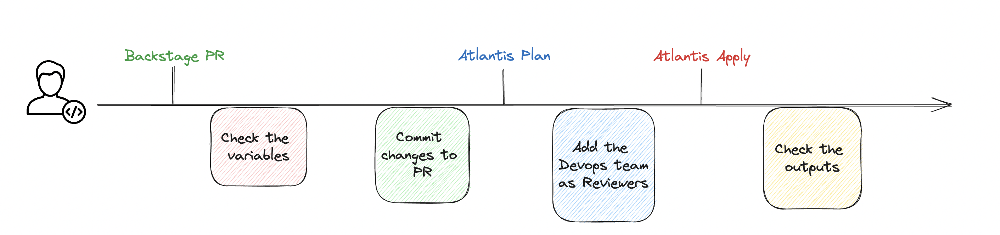

# Terraform

## Workflow

## Provisioned resources
----------------------
Secret Manager,
IAM role, Policy, 
Harness Pipeline and Harness Service.

## Input variables
------------------
The file [terraform.tfvars](./terraform.tfvars) contains the variables to upload resources. Modify it as needed.

| Varible | Description |
| -------- | ----------- |
| `application_name` | Application name |
| `namespace_identifier` | Application namespace |
| `repository` | Github application repository |
| `business_owner` | Application squad owner|
| `inline_policies` | Policies in Json that allow the application role to access AWS resources |

## How does the application access other resources in AWS besides those provisioned?
------------------------------------------------------------------------
Applications access AWS resources with the Application Service Account assuming the role that is created. Each role has policies attached giving the allow for the specific resource. By default, the role already accesses the Secret Manager, but if you need to access more resources, you need to link the policies to the role, which must be done as follows: 

1. Add the Json file with the inline policy in the [policies](policies) folder (to generate the policy go to: [Policy Generator](https://awspolicygen.s3.amazonaws.com/policygen.html) )
2. In the file [terraform.tfvars](./terraform.tfvars), add the key and value of the policy to the variable, `inline_policies`, with the `key = resource type` and the `value = .json file`
 
For more information about policies please visit the [documentation](https://docs.aws.amazon.com/IAM/latest/UserGuide/access_policies_managed-vs-inline.html#:~:text=Creating%20IAM%20policies-,Inline%20policies,-An%20inline%20policy)
